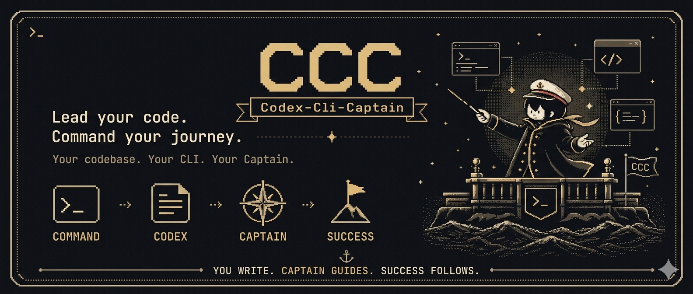

# Codex-Cli-Captain-Release

<p align="center">
  <a href="./README.md">English</a> ·
  <a href="./README.ko.md">한국어</a> ·
  <a href="./README.ja.md">日本語</a>
</p>

<p align="center">
  
</p>

현재 공개 버전: `0.0.3`.

Codex CLI는 이미 똑똑합니다. 그 똑똑함을 조금 더 잘 활용하고 싶으신가요? 100달러 요금제도 나왔고, 이제는 모델을 더 막연히 쓰기보다 합리적인 과정으로 쓰고 싶을 때입니다. CCC에 오신 것을 환영합니다. 이제 요청 앞에 `$cap`만 붙이면, Codex-Cli-Captain이 captain-led 흐름으로 작업을 정리하고 적절한 에이전트를 거쳐 결과를 돌려줍니다.

## 설치

Codex CLI에 아래 문구를 붙여넣으세요.

```text
Install Codex-Cli-Captain from https://github.com/HoRi0506/Codex-Cli-Captain-Release by running:
curl -fsSL https://raw.githubusercontent.com/HoRi0506/Codex-Cli-Captain-Release/main/install.sh | bash

After installation finishes, fully exit Codex CLI.
Start a new Codex CLI session.
Then run:
ccc check-install
```

## 설정 변경 반영

`~/.config/foreman/ccc-config.toml`을 수정한 뒤 Codex CLI에 아래 문구를 붙여넣으세요.

```text
Run:
ccc setup

Then fully exit Codex CLI.
Start a new Codex CLI session.
Then run:
ccc check-install
```

## 추천 역할 설정

| CCC role | Agent | 추천 모델 | Reasoning | 용도 |
| --- | --- | --- | --- | --- |
| `orchestrator` | `captain` | `gpt-5.4` | `high` | LongWay 관리와 최종 라우팅 판단 |
| `way` | `tactician` | `gpt-5.4` | `medium` | 계획 수립과 다음 작업 선택 |
| `explorer` | `scout` | `gpt-5.4-mini` | `medium` | 읽기 전용 repo 조사 |
| `code specialist` | `raider` | `gpt-5.3-codex` | `high` | 코드/config 수정과 복구 |
| `documenter` | `scribe` | `gpt-5.4-mini` | `medium` | README, 릴리즈 노트, 사용자 문구 |
| `verifier` | `arbiter` | `gpt-5.4` | `medium` | 리뷰, 리스크, 회귀 확인 |
| `companion_reader` | `companion_reader` | `gpt-5.4-mini` | `medium` | 저비용 filesystem/docs/web/git/gh 읽기 작업 |
| `companion_operator` | `companion_operator` | `gpt-5.4-mini` | `medium` | 저비용 git/gh 변경 및 좁은 도구 실행 |
